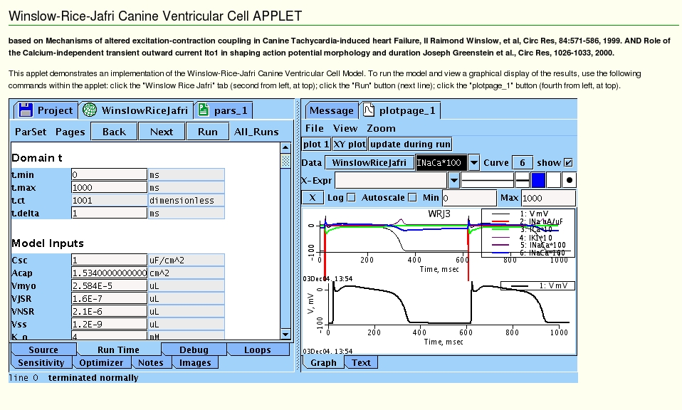

Readme for a web-link to the model code associated with the papers:

## References

**Ref 1:** Raimond Winslow, et al,
Mechanisms of altered excitation-contraction coupling
in Canine Tachycardia-induced heart Failure, II
*Circ Res*, 84:571-586, 1999.

**Ref 2:** Joseph Greenstein et al.,
Role of the Calcium-independent transient outward current
Ito1 in shaping action potential morphology and duration
*Circ Res*, 1026-1033, 2000.

## Model Code Availability

The java model code is available from [http://nsr.bioeng.washington.edu/PLN/Members/garyr/electrophysiology/WinslowRiceJafriCanineVentricularCell.proj/view](http://nsr.bioeng.washington.edu/PLN/Members/garyr/electrophysiology/WinslowRiceJafriCanineVentricularCell.proj/view)

## How to Run the Model

If you have Java installed and the plug-in is properly installed in your browser you can run the model [online](http://nsr.bioeng.washington.edu/PLN/Members/garyr/electrophysiology/winslowricejafricanineventricularcell) (including the ability to edit parameters as an applet).
After you run the model (see online instructions) your browser will look something like this:

---

2025-05-27 – Standardized to Markdown.
